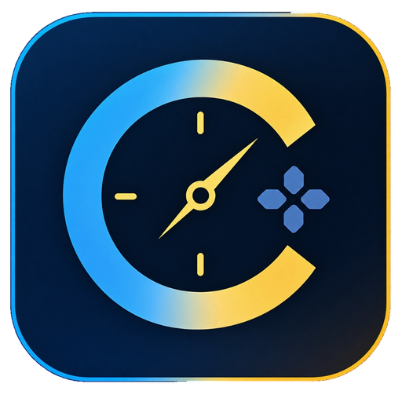

<p align="center">
  
</p>

<h1 align="center">Chrona</h1>

<p align="center">Your library, in one place.</p>

<p align="center">
  A local-first Windows launcher for Steam, Epic, Ubisoft, Xbox, and your own game folders.
</p>

<p align="center">
  <a href="https://github.com/calibrenyc/Chrona/releases/latest"><strong>Download Chrona for Windows</strong></a>
  &nbsp; · &nbsp;
  <a href="https://github.com/calibrenyc/Chrona/releases">Release notes</a>
  &nbsp; · &nbsp;
  <a href="https://github.com/calibrenyc/Chrona/issues">Report an issue</a>
</p>

## Get started

1. Open the [latest release](https://github.com/calibrenyc/Chrona/releases/latest) and download **ChronaSetup-…exe**.
2. Run setup. Choose your installation folder, game libraries, appearance, and shortcuts.
3. Launch Chrona and bring your games together.

**Requires 64-bit Windows.** Your games and their original launchers may still require their own accounts or installations.

The current release is **unsigned**, so Windows may show an unknown-publisher or SmartScreen warning.

## Made for your library

- **One place to play.** Browse and launch games from supported launchers and local folders.
- **Automatic discovery.** Find Steam libraries through Steam's configuration and detect supported local installations.
- **Make it yours.** Choose light or dark appearance, library views, and cover artwork.
- **Built-in updates.** Check for new Chrona releases in Settings, download an update, and let Chrona restart into the new version.
- **Your setup stays with you.** Updates preserve your saved libraries, game paths, accounts, preferences, and local metadata.

## Updating

Chrona checks stable GitHub Releases for application updates. You can also select **Check for Chrona updates** in Settings. After an update, What's New appears before your library.

Coming from an older portable version? Run the installer once to switch to the installed application. Your existing Chrona configuration is retained.

## Your data

Chrona stores its library and settings separately from the application:

```text
%APPDATA%\chrona-game-launcher
```

Uninstalling keeps this data unless you explicitly select **Remove Chrona user data and settings**. Back up this folder if you want to keep a separate copy of your configuration.

## Release files

| File | Purpose |
| --- | --- |
| `ChronaSetup-…exe` | Installer for new installations and manual upgrades. |
| `Chrona-Update-…-win-x64.zip` | Full application package used by the built-in updater. |
| `Chrona-…-SHA256SUMS.txt` | Checksums for verifying release downloads. |

This repository hosts Chrona's official Windows downloads and release notes.
